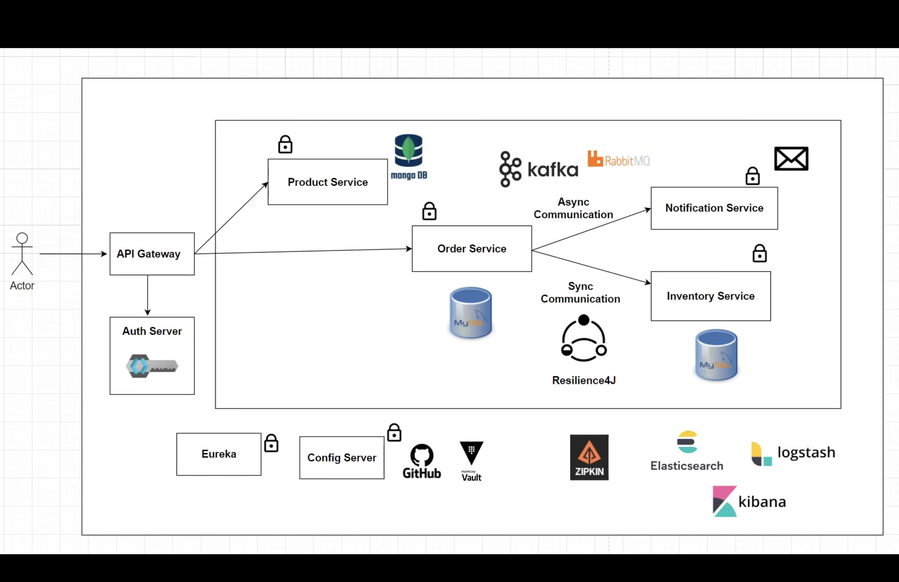
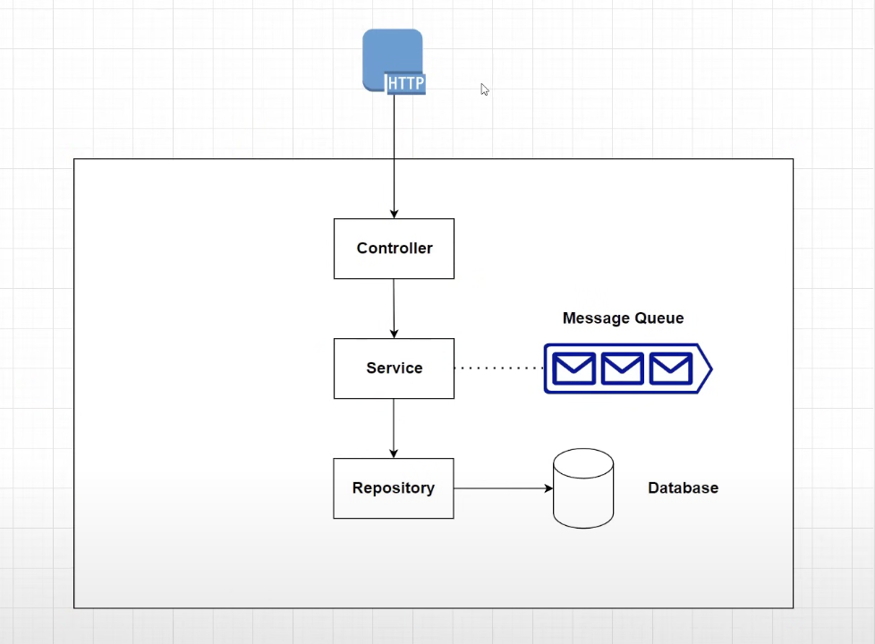

# Architecture Diagram

# Services
## Product Service
- Create and view products, act as a catalog
- Talks to a Mongodb instance

## Order Service
- Can order products, needs to communicate with inventory and notificaiton services, synchronously and asynchronously respectively.
- Talks to a MySQL db instance

## Inventory Service
To check whether or not a product is in stock
- Talks to a MySQL db instance

## Notification Service
- On successful order placement, send a notifcation for acknowledgement
- Stateless service, no db
 
## Logical architecture of a service

# Outside Entities / Other components
## API Gateway
- Controls auth and redirection of users to services securely.
- a gatekeeper for the service from the outside world

## Authentication
- Secured the application with a authorization server, KeyCloak

## Eureka

## Config Server

## Git

## Zipkin

## Monitoring
### Prometheus
### Grafana
